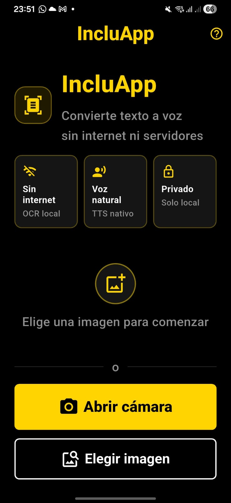
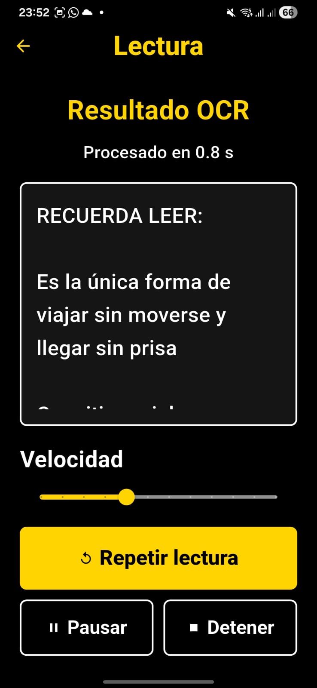
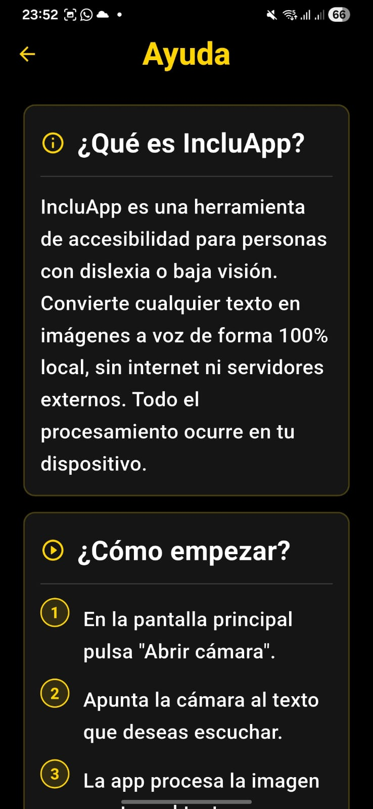
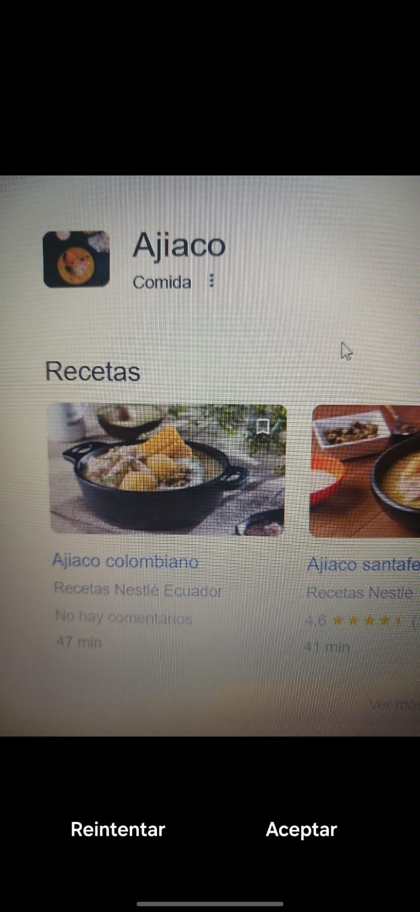
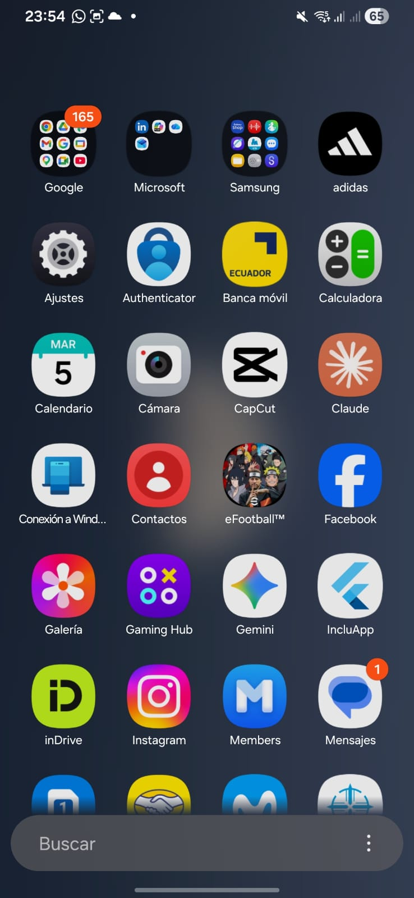

<div align="center">


<br/>
<br/>

# LexiEdu

### Convierte texto impreso en voz — sin internet, sin servidores

[](https://flutter.dev)
[](https://dart.dev)
[](https://developer.android.com)
[](LICENSE)
[](https://github.com/StevenAJ23/LexiEdu/releases/tag/v1.0.0)

<br/>

> Herramienta de accesibilidad educativa para estudiantes con **dislexia o baja visión**.  
> OCR local · Síntesis de voz · Alto contraste · 100% offline

**[Descargar APK](https://github.com/StevenAJ23/LexiEdu/releases/tag/v1.0.0)** · **[Ver capturas](docs/Capturas.md)** · **[Reportar un problema](https://github.com/StevenAJ23/LexiEdu/issues)**

</div>

---

## ¿Qué es LexiEdu?

**LexiEdu** es una aplicación móvil Flutter diseñada para reducir las barreras de acceso al contenido escrito. Apunta la cámara a cualquier texto impreso — un libro, una pizarra, un apunte — y la app lo convierte en audio al instante.

Todo el procesamiento ocurre **dentro del dispositivo**. Sin internet, sin nube.

```
📸 Fotografía el texto  →  🔍 OCR analiza la imagen  →  🔊 Texto se lee en voz alta
```

---

## Características

| | Función | Detalle |
|---|---|---|
| 📷 | **Cámara y galería** | Capturá texto desde la cámara o elegí una imagen existente |
| 🔍 | **OCR local** | Google ML Kit — sin enviar datos a ningún servidor |
| 🔊 | **Síntesis de voz** | Motor TTS nativo de Android/iOS en español |
| ⚡ | **4 velocidades** | Muy lenta · Lenta · Normal · Rápida |
| 📋 | **Copiar texto** | Copiá el texto detectado al portapapeles con un toque |
| 📊 | **Estadísticas** | Contador de palabras y tiempo de procesamiento |
| 💾 | **Historial local** | Lecturas guardadas en Hive (NoSQL en el dispositivo) |
| 🌙 | **Alto contraste** | Negro / Amarillo — cumple estándar WCAG AA |
| 🔒 | **Privacidad total** | Ningún dato sale del dispositivo |
| 📴 | **Sin internet** | Funciona completamente offline |

---

## Capturas de pantalla

<div align="center">

| Pantalla principal | Resultado OCR | Ayuda |
|---|---|---|
|  |  |  |

| Cámara | APK instalada |
|---|---|
|  |  |

</div>

---

## Instalación rápida (APK)

> La forma más rápida de probar LexiEdu sin necesitar Flutter instalado.

1. Descargá el APK desde [Releases](https://github.com/StevenAJ23/LexiEdu/releases/tag/v1.0.0)
2. En tu Android: **Ajustes → Seguridad → Instalar desde fuentes desconocidas** (activar)
3. Abrí el archivo `LexiEdu-v1.0.0.apk` e instalalo
4. Concedé los permisos de cámara y galería al iniciarlo por primera vez

**Requisitos mínimos:** Android 5.0 (API 21) · ~77 MB de espacio libre

---

## Instalación para desarrolladores

### Requisitos previos

- Flutter SDK ≥ 3.0 ([instalar Flutter](https://docs.flutter.dev/get-started/install))
- Android Studio o VS Code con extensión Flutter
- Dispositivo Android o emulador

### Clonar y ejecutar

```bash
# 1. Clonar el repositorio
git clone https://github.com/StevenAJ23/LexiEdu.git
cd LexiEdu

# 2. Instalar dependencias
flutter pub get

# 3. Verificar entorno
flutter doctor

# 4. Ejecutar en dispositivo/emulador
flutter run
```

### Generar APK

```bash
# APK release (recomendado)
flutter build apk --release

# APK debug (para desarrollo)
flutter build apk --debug
```

El APK generado se encuentra en:
```
build/app/outputs/flutter-apk/app-release.apk
```

---

## Arquitectura

```
lib/
├── core/
│   ├── theme/          → AppTheme: colores, tipografía WCAG AA, estilos globales
│   └── utils/          → AppSnackBar: notificaciones visuales
├── data/
│   └── services/
│       ├── ocr_service.dart   → Google ML Kit Text Recognition (OCR local)
│       └── tts_service.dart   → Flutter TTS (síntesis de voz nativa)
├── presentation/
│   ├── screens/
│   │   ├── camera_screen.dart  → Pantalla principal (cámara / galería)
│   │   ├── reader_screen.dart  → Resultados OCR + controles TTS
│   │   └── help_screen.dart    → Ayuda y sección Acerca de
│   └── widgets/
│       └── feature_card.dart   → Tarjeta de funcionalidad reutilizable
└── main.dart           → Inicialización, Hive, orientación, tema
```

**Flujo de datos:**
```
CameraScreen → OcrService (ML Kit) → ReaderScreen → TtsService (TTS nativo)
                                          ↓
                                    Hive (historial local)
```

---

## Stack tecnológico

| Paquete | Versión | Rol |
|---|---|---|
| `flutter` | SDK ≥ 3.0 | Framework UI multiplataforma |
| `google_mlkit_text_recognition` | ^0.13.0 | OCR local (Google ML Kit) |
| `flutter_tts` | ^4.0.2 | Síntesis de voz nativa |
| `hive` + `hive_flutter` | ^2.2.3 | Base de datos local (NoSQL) |
| `image_picker` | ^1.1.2 | Cámara y galería |
| `camera` | ^0.11.0+2 | Acceso directo a la cámara |
| `permission_handler` | ^11.3.1 | Permisos en tiempo de ejecución |
| `path_provider` | ^2.1.3 | Rutas del sistema de archivos |

> LexiEdu **no usa** Firebase, AWS, APIs de pago ni ningún servicio externo.

---

## Permisos requeridos

### Android (`AndroidManifest.xml`)
```xml
<uses-permission android:name="android.permission.CAMERA" />
<uses-permission android:name="android.permission.READ_MEDIA_IMAGES" />
```

### iOS (`Info.plist`)
```xml
<key>NSCameraUsageDescription</key>
<string>LexiEdu usa la cámara para capturar texto impreso.</string>
<key>NSPhotoLibraryUsageDescription</key>
<string>LexiEdu permite elegir imágenes de la galería para reconocer texto.</string>
```

---

## Estado del proyecto

| Atributo | Detalle |
|---|---|
| Versión | **1.0.0** |
| Estado | PMV funcional — APK probada en dispositivo Android |
| Plataforma principal | Android |
| Plataformas secundarias | iOS · Web (visualización de UI) |
| Privacidad | Sin servidores · Sin tracking · 100% local |

### Roadmap

- [x] OCR local con Google ML Kit
- [x] Síntesis de voz TTS en español
- [x] 4 velocidades de lectura
- [x] Copiar texto al portapapeles
- [x] Contador de palabras y tiempo de procesamiento
- [x] Historial local con Hive
- [x] Diseño accesible WCAG AA
- [x] Logo PUCE integrado
- [ ] Exportar texto como archivo `.txt`
- [ ] Soporte multiidioma
- [ ] Historial con búsqueda y filtrado
- [ ] Firma para distribución en Play Store

---

## Equipo

| Nombre | Rol Scrum | Área técnica |
|---|---|---|
| **Juan C. Cevallos** | Scrum Master / Dev | Arquitectura, documentación, backlog |
| **Kevin Daniel Cepeda Lema** | Product Owner | Validación, requisitos, criterios de aceptación |
| **Steven Ariel Rosero** | Developer | OCR, permisos, captura de imagen |
| **Victoria Yulieth Galarza Taco** | QA / Developer | Pruebas funcionales, accesibilidad, evidencias |

---

<div align="center">

Desarrollado como proyecto académico en la


**Pontificia Universidad Católica del Ecuador**  
Carrera de Ingeniería en Sistemas · Emprendimiento Tecnológico · 2026

</div>
