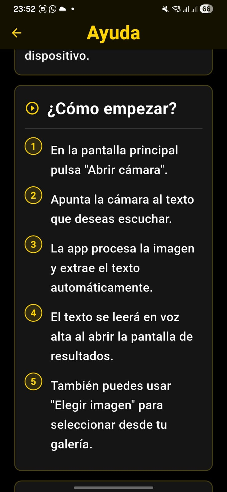
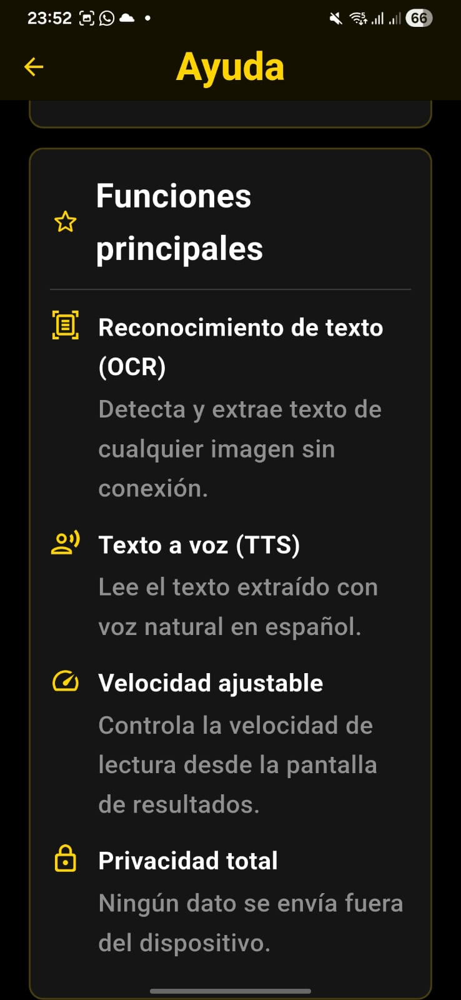
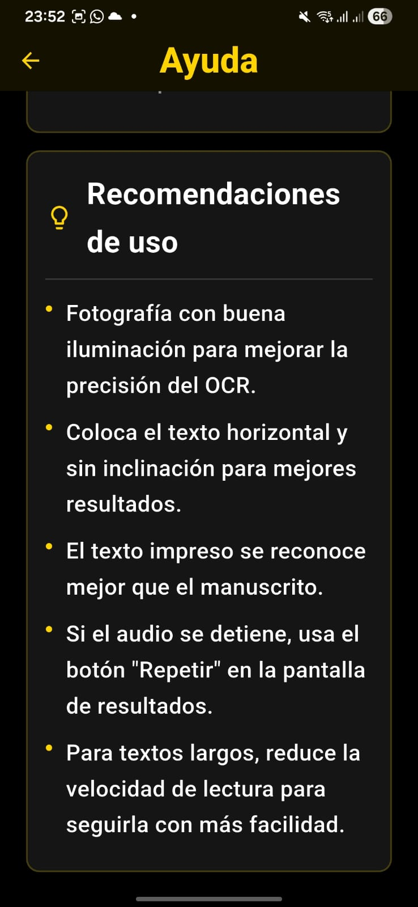

# Capturas de funcionamiento - IncluApp

Este archivo contiene evidencias visuales del funcionamiento de IncluApp en un dispositivo Android.

## Pantalla principal

La aplicación muestra la pantalla principal con diseño accesible, alto contraste, botones grandes y acceso a cámara o galería.


## Pantalla de ayuda: descripción general

La pantalla de ayuda explica qué es IncluApp y su enfoque de accesibilidad.


## Pantalla de ayuda: cómo empezar

La guía indica los pasos básicos para capturar o elegir una imagen y convertir el texto a voz.



## Pantalla de ayuda: funciones principales

La aplicación presenta funciones como OCR, texto a voz, velocidad ajustable y procesamiento local.



## Pantalla de ayuda: recomendaciones de uso

Se muestran recomendaciones para mejorar la precisión del OCR y facilitar la lectura.



## Captura de imagen desde cámara

Evidencia del uso de la cámara para tomar una fotografía de texto o contenido visual.


## Resultado OCR y lectura

La aplicación procesa la imagen, muestra el resultado OCR y permite controlar la lectura mediante voz.


## Aplicación instalada en Android

Evidencia de IncluApp instalada en un dispositivo Android.


## Comandos usados

```bash
flutter pub get
flutter build apk --debug
```

## Observación

IncluApp fue probada en un dispositivo Android mediante APK generado en modo debug. Las capturas evidencian instalación, pantalla principal, ayuda, captura de imagen, OCR y lectura por voz.
